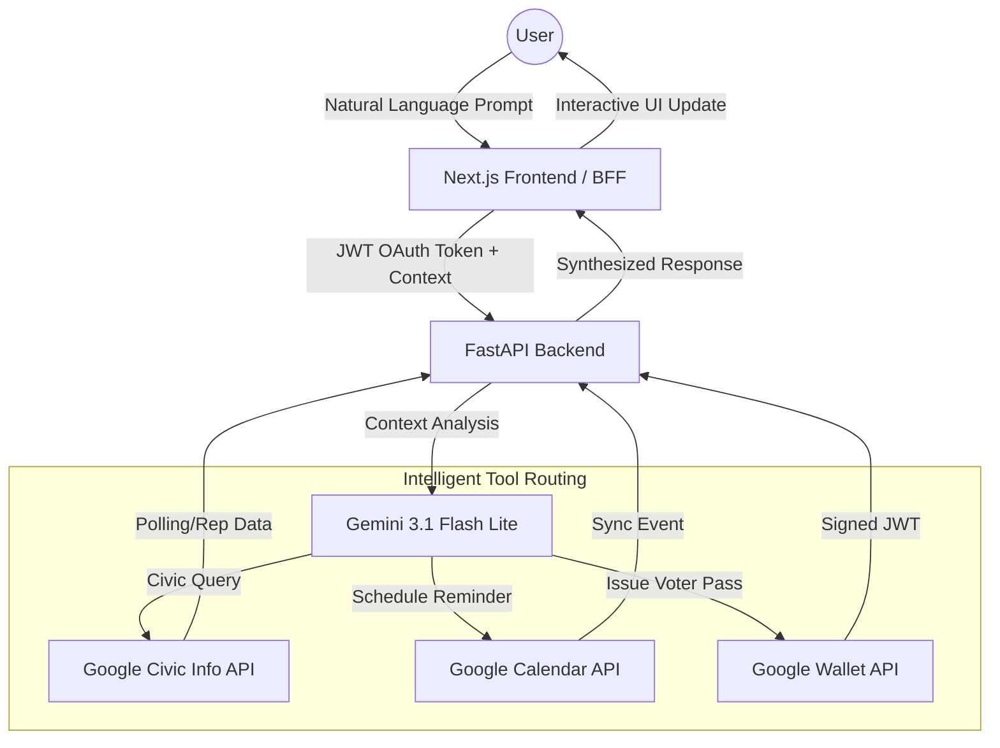

# The Civic Navigator 🗺️🗳️

**The Civic Navigator** is an interactive, privacy-first election assistant built to help users seamlessly navigate the voting process. 

---

## 🎯 Chosen Vertical
**Government & Civic Engagement**

We chose this vertical because navigating election information—such as finding accurate polling locations, understanding complex voting jargon, and remembering registration deadlines—can be confusing and fragmented. The Civic Navigator centralizes this experience into a single, intelligent chat interface, increasing civic participation and empowering voters with reliable, real-time data.

## 🧠 Approach and Logic
Our core approach is built around **Decoupled Architecture**, **AI Agent Routing**, and **Privacy-by-Design**:
1. **Decoupled Architecture**: We use a Next.js frontend acting as a Backend-For-Frontend (BFF) proxy to securely manage OAuth tokens without exposing them to the browser. The logic engine sits in a separate Python FastAPI backend.
2. **AI Agent Routing**: Instead of relying on rigid decision trees, we utilize **Gemini 3.1** via the `google-genai` SDK as an intelligent router. It parses natural language to automatically map user intent to the correct Google API integration using structured tool-calling.
3. **Enterprise Secret Management**: We utilize Google Cloud Secret Manager to securely inject credentials into our Cloud Run containers at boot, ensuring 100% parity with local development while keeping keys out of source control.
4. **Privacy-by-Design**: User locations and addresses are strictly treated as ephemeral context. They are wiped immediately after the HTTP response resolves and are explicitly scrubbed from server logs.

## ⚙️ How the Solution Works
1. **The Request**: A user asks a question via the Next.js UI (e.g., *"Where do I vote? I live at 123 Main St."*).
2. **The Proxy**: The Next.js BFF securely injects the user's Google OAuth Calendar/Wallet tokens into the request headers and forwards it to the Python backend.
3. **The Brain**: The FastAPI backend receives the context. The Gemini model evaluates the prompt against four specialized tools:
   - **Google Civic Information API**: Fetches polling locations or representative data.
   - **Google Calendar API**: Syncs election deadlines with 24-hour reminders directly to the user's calendar.
   - **Google Wallet API**: Generates a cryptographically signed JWT to provision a Digital "Voter Readiness Pass".
   - **Google Cloud Translation**: Uses an `@lru_cache` optimized pipeline to translate complex voting jargon.
4. **The Execution**: Gemini executes the appropriate function, waits for the API response, synthesizes the JSON data into a helpful, conversational response, and returns it to the user.

## 💡 Assumptions Made
1. **Google Ecosystem**: We assume users have an active Google Account to fully utilize the Calendar and Wallet integration features. OAuth 2.0 is specifically tailored for Google Provider.
2. **Ephemeral Context**: We assume that storing user addresses is an unacceptable security risk for an election app. Therefore, no persistent database is used for location storage. Users must provide or confirm their address in the chat session.
3. **GCP Configuration**: We assume the deployment environment (Google Cloud Run) has a Service Account (`civic-navigator-sa`) provisioned with `roles/secretmanager.secretAccessor` to read API keys at startup, as automated in our `deploy.sh` script.

---

## 🗺️ System Flow


---

## 🏗 Architecture & Technical Stack
- **Frontend**: Next.js (App Router), React, TailwindCSS, NextAuth.js
- **Backend**: Python 3.11, FastAPI, Uvicorn, Pydantic
- **AI**: Google Gemini 3.1 (`google-genai` SDK)
- **Deployment**: Google Cloud Run, GCP Secret Manager

## 🛠️ Local Development Setup

### Prerequisites
- Node.js (v18+)
- Python 3.11+ (Conda recommended)
- A Google Cloud Project with the following APIs enabled: **Generative Language API**, **Civic Information API**, **Google Calendar API**, and **Google Wallet API**.
- **Authorized Redirect URIs**: In Google Cloud Console, add `http://localhost:3000/api/auth/callback/google` to your OAuth Client.

### 1. Backend Setup
1. Run following commands to setup virtual environment and install dependencies:
```bash
cd backend
conda create -n promptWars2-py311 python=3.11 -y
conda activate promptWars2-py311
pip install -r requirements.txt
```
2. Copy `.env.example` to `.env` and fill in your keys:
   - `GEMINI_API_KEY`, `CIVIC_INFO_API_KEY`, `WALLET_ISSUER_ID`, `GOOGLE_APPLICATION_CREDENTIALS`

3. Run: `python -m uvicorn app.main:app --reload --port 8000`

> [**!TIP**]
> To get your `service-account.json`, go to **IAM & Admin > Service Accounts**, create a key in JSON format, and move it to the `backend/` folder. Ensure it has roles for Vertex AI and Wallet.

### 2. Frontend Setup
1. Run following commands to setup npm dependencies:
```bash
cd frontend
npm install
```
2. Copy `.env.example` to `.env.local` and fill in your OAuth keys:
   - `GOOGLE_CLIENT_ID`, `GOOGLE_CLIENT_SECRET`, `NEXTAUTH_SECRET`
3. Run: `npm run dev` (Available at `http://localhost:3000`)

### 3. Google Wallet Setup (Optional)
1. Get your **Issuer ID** from the [Google Pay & Wallet Console](https://pay.google.com/gp/m/issuer/list).
2. Create a **Class** (e.g., suffix `voter_pass`).
3. Set `WALLET_CLASS_ID` in your `.env` as `[ISSUER_ID].[SUFFIX]`.
4. Ensure your account is in **Demo Mode** for testing.

---

## ☁️ Production Deployment & Secret Manager Setup

This project uses **Google Cloud Run** and **Secret Manager** to securely manage credentials in production without exposing them in code.

### Step 1: Push Secrets to GCP
Before deploying, you must create these secrets in your Google Cloud environment using your actual keys. **Run these commands in your terminal**, replacing the placeholders with your real values:

```bash
# 1. Backend Secrets
echo -n "<YOUR_GEMINI_API_KEY>" | gcloud secrets create gemini-api-key --data-file=-
echo -n "<YOUR_CIVIC_INFO_API_KEY>" | gcloud secrets create civic-info-api-key --data-file=-

# 2. Frontend Secrets
echo -n "<YOUR_NEXTAUTH_SECRET>" | gcloud secrets create nextauth-secret --data-file=-
echo -n "<YOUR_GOOGLE_CLIENT_ID>" | gcloud secrets create google-oauth-client-id --data-file=-
echo -n "<YOUR_GOOGLE_CLIENT_SECRET>" | gcloud secrets create google-oauth-client-secret --data-file=-
```

### Step 2: Run the Deployment Script
Once the secrets are safely stored in GCP, run the automated deployment script from the root of the project:

```bash
chmod +x deploy.sh
./deploy.sh
```

The script will automatically:
1. Create a secure Service Account (`civic-navigator-sa`).
2. Grant it permission to read from Secret Manager.
3. Deploy the backend and frontend to Cloud Run, securely injecting the secrets at boot via the `--set-secrets` flag.

---
**Prepared for Project Submission.**
